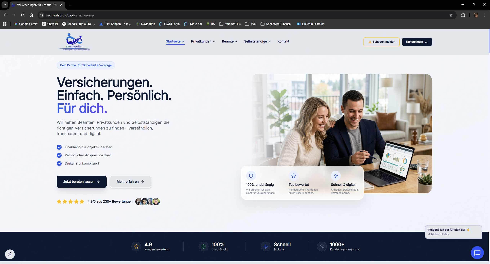
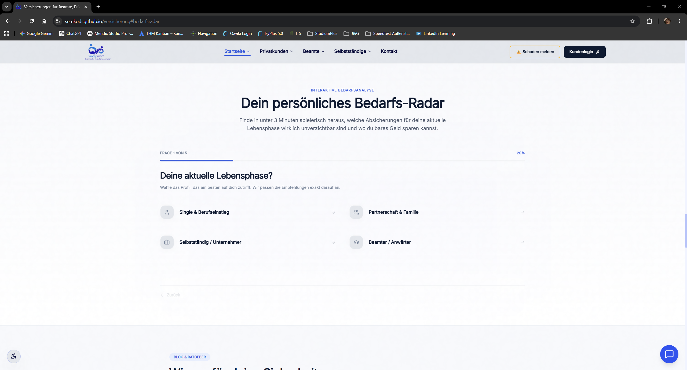
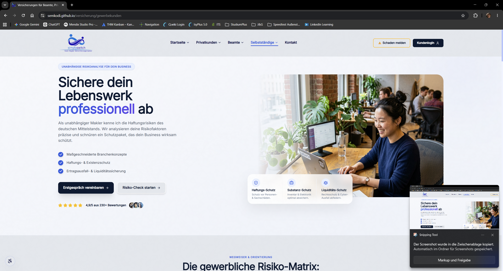
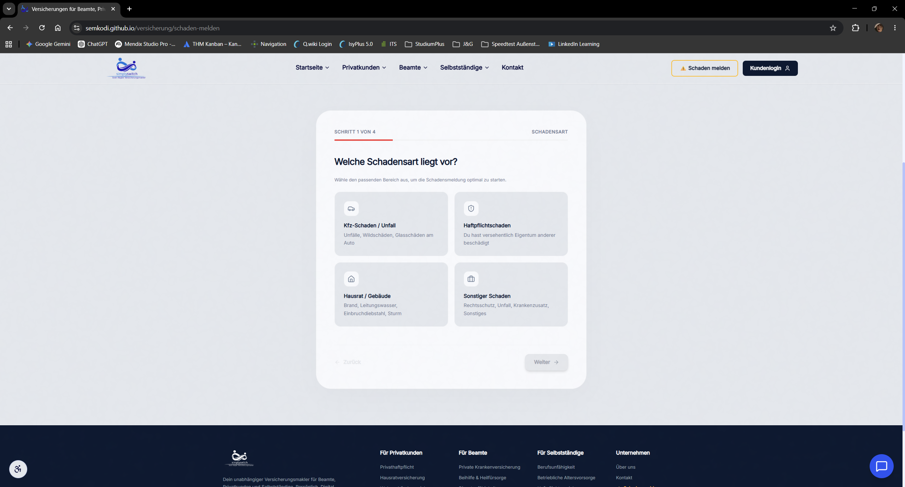
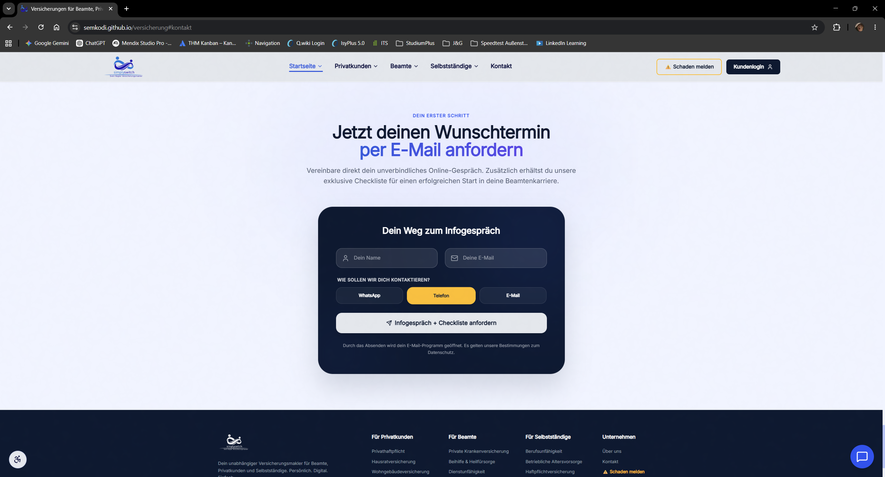

# 🚀 Simply Switch – Digitale Versicherungsplattform


Moderne Versicherungsplattform für Privatkunden, Gewerbekunden und Beamte.

🌐 **Live-Demo:** https://semkodi.github.io/versicherung

Entwickelt von **Semir Borogovac** als praxisnahes Webprojekt für den Versicherungsmakler **Sven Kegler**.

## ✅ Projektstatus

- Responsive Design
- Moderne React-Architektur
- TypeScript
- GitHub Pages Deployment
- Interaktive Bedarfsanalyse
- Praxisprojekt

---

## 📖 Projektübersicht

Simply Switch unterstützt Interessenten dabei, ihren Versicherungsbedarf digital zu analysieren, Schäden zu melden und unkompliziert Kontakt zu einem Versicherungsexperten aufzunehmen.

## 📸 Screenshots

| Startseite | BedarfsRadar |
|------------|--------------|
|  |  |

| Selbstständige | Schadensmeldung |
|------------|--------------|
|  |  |

### Kontaktformular



## 🤝 Praxisbezug

Dieses Projekt wurde nicht als Tutorial oder Lernprojekt erstellt, sondern zur Umsetzung realer Anforderungen eines Versicherungsmaklers entwickelt.

---

## ✨ Features

- 🏠 Startseite mit Hero-Bereich, Zielgruppen, Bewertungen und FAQ
- 👥 Privatkundenbereich
- 🎖️ Beamtenbereich
- 💼 Gewerbekundenbereich
- 📊 Interaktives Bedarfs-Radar
- 📬 Kontaktformular
- ⚠️ Schadensmeldung
- 📱 Vollständig responsives Design
- ♿ Barrierefreiheitsfunktionen
- 🍪 Cookie-Consent

---

## 🛠 Tech-Stack

| Bereich | Technologie |
|----------|------------|
| Frontend | React |
| Sprache | TypeScript |
| Styling | Tailwind CSS |
| Routing | React Router |
| Animationen | Framer Motion |
| Backend Services | Supabase |
| Build Tool | Vite |
| Deployment | GitHub Pages |

---

## 🏗️ Architektur

```text
Benutzer
    │
    ▼
React + TypeScript
    │
    ▼
React Router
    │
    ├── Startseite
    ├── Privatkunden
    ├── Gewerbekunden
    ├── Beamte
    └── Schaden melden
```

---

## ⚡ Herausforderungen

- Aufbau einer skalierbaren Komponentenarchitektur
- Optimierung der Ladezeiten durch Lazy Loading
- Umsetzung moderner Animationen mit Framer Motion
- Responsive Umsetzung für Desktop, Tablet und Smartphone
- Deployment über GitHub Pages

---

## 📚 Lessons Learned

- React-Komponentenarchitektur
- TypeScript
- React Router
- Responsive Webdesign
- Deployment-Prozesse
- Git und GitHub Workflows
- Zusammenarbeit mit einem realen Auftraggeber

---

## 🚀 Lokale Entwicklung

```bash
git clone https://github.com/Semkodi/versicherung.git
cd versicherung
npm install
npm run dev
```

---

## 📁 Projektstruktur

```text
src/
├── assets/
├── komponenten/
│   ├── home/
│   ├── kontakt/
│   ├── layout/
│   ├── rechner/
│   └── ui/
├── seiten/
└── lib/
```

---

## 👨‍💻 Entwickler

**Semir Borogovac**

Umschulung zum Fachinformatiker für Anwendungsentwicklung (FIAE)

---

## 🤝 Projektpartner

**Sven Kegler**

Versicherungsmakler